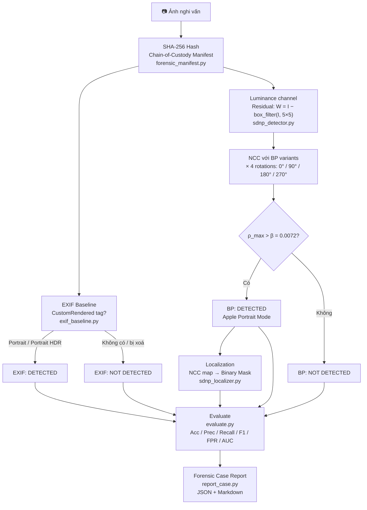

# Apple SDNP Forensic Toolkit
NT334.Q21.ANTT — Digital Forensics

---

## 📌 Giới thiệu (Overview)

Đây là đồ án môn học **Pháp chứng kỹ thuật số (Digital Forensics)**. Đề tài tập trung vào việc nghiên cứu và thực nghiệm dựa trên bài báo: *"Apple's Synthetic Defocus Noise Pattern: Characterization and Forensic Applications"*.

Dự án phân tích nhiễu giả lập **SDNP** trong chế độ chụp Chân dung (Portrait Mode) của iPhone và xây dựng forensic pipeline để:

- Phát hiện ảnh Apple Portrait Mode kể cả khi **EXIF bị xoá**
- Định vị vùng bokeh giả (localization)
- Đánh giá ảnh hưởng của SDNP đến kỹ thuật xác thực nguồn gốc camera (**PRNU**)

Pipeline mở rộng repo chính thức bằng: chain-of-custody manifest, EXIF baseline, robustness experiment, metrics đầy đủ, và forensic case report.

---

## ⚖️ Bài toán & Mô hình đe dọa

**Vấn đề:** Các thuật toán PRNU truyền thống bị nhầm lẫn giữa nhiễu vật lý (phần cứng) và nhiễu SDNP (phần mềm Apple chèn vào vùng bokeh). Điều này dẫn đến **Fingerprint Collision** — nhiều máy khác nhau bị nhận diện nhầm là cùng một máy.

**Mục tiêu của đồ án:**
- Xây dựng detector phát hiện ảnh Apple Portrait Mode bằng Base Pattern (BP)
- So sánh với EXIF baseline (CustomRendered tag) — thất bại khi EXIF bị xoá
- Đánh giá độ bền (robustness) khi ảnh bị strip EXIF / recompress / resize

---

## 🛠 Cài đặt

Yêu cầu Python ≥ 3.12. Xem `requirements.txt` để biết đầy đủ các thư viện.

```bash
python3 -m venv .venv
source .venv/bin/activate
pip install -r requirements.txt
```

---

## 🗂 Cấu trúc thư mục

```
./
├── src/
│   ├── BP_utils.py             ← Thư viện gốc từ repo chính thức (Apache 2.0)
│   ├── forensic_manifest.py    ← SHA-256 + chain-of-custody CSV
│   ├── exif_baseline.py        ← EXIF-only detector (baseline so sánh)
│   ├── sdnp_detector.py        ← BP detection: NCC + 4 rotations + threshold
│   ├── sdnp_localizer.py       ← NCC map + binary mask (localization)
│   ├── transform_images.py     ← Strip EXIF / JPEG recompress / resize
│   ├── evaluate.py             ← Metrics: Acc, Prec, Recall, F1, FPR, AUC
│   └── report_case.py          ← Forensic case report (JSON + Markdown)
├── scripts/
│   ├── run_original.sh         ← Pipeline chính + no-rotation baseline
│   ├── run_robustness.sh       ← Robustness experiment
│   └── reproduce_all.sh        ← Chạy toàn bộ
├── data/
│   ├── labels.csv              ← Ground truth (filename, label, source, notes)
│   ├── raw/                    ← Ảnh gốc (không commit)
│   ├── processed/              ← Ảnh sau transform (không commit)
│   └── bp/                     ← BP .mat files (không commit — tải từ repo gốc)
├── results/                    ← Output của pipeline (không commit)
└── deliverables/
    ├── report/                 ← LaTeX report
    └── slides/                 ← Presentation
```

---

## 🚀 Quy trình thực hiện (Pipeline)



**Chuẩn bị dữ liệu:** đặt ảnh vào `data/raw/`, điền `data/labels.csv`:

```csv
filename,label,source,notes
portrait_01.jpg,1,self-captured,iPhone 14 Portrait Mode
normal_01.jpg,0,self-captured,iPhone 14 standard
```

**Chạy:**

```bash
source .venv/bin/activate
bash scripts/reproduce_all.sh
```

---

## 📊 Kết quả thực nghiệm

*(Cập nhật sau khi chạy pipeline)*

| Điều kiện | Acc | Recall/TPR | FPR | F1 | AUC |
|-----------|-----|-----------|-----|----|-----|
| Original | — | — | — | — | — |
| EXIF stripped | — | — | — | — | — |
| JPEG Q80 | — | — | — | — | — |
| Resize 0.5 | — | — | — | — | — |
| No-rotation baseline | — | — | — | — | — |
| EXIF baseline | — | — | — | — | — |

---

## 📜 Tài liệu tham khảo

> David Vázquez-Padín, Fernando Pérez-González, Pablo Pérez-Miguélez.
> *"Apple's Synthetic Defocus Noise Pattern: Characterization and Forensic Applications."*
> IEEE Transactions on Information Forensics and Security, 2026.
> [IEEE](https://ieeexplore.ieee.org/document/11346806) | [arXiv 2505.07380](https://arxiv.org/abs/2505.07380)
>
> Repo chính thức: [github.com/dvazquezpadin/apple-sdnp](https://github.com/dvazquezpadin/apple-sdnp)
