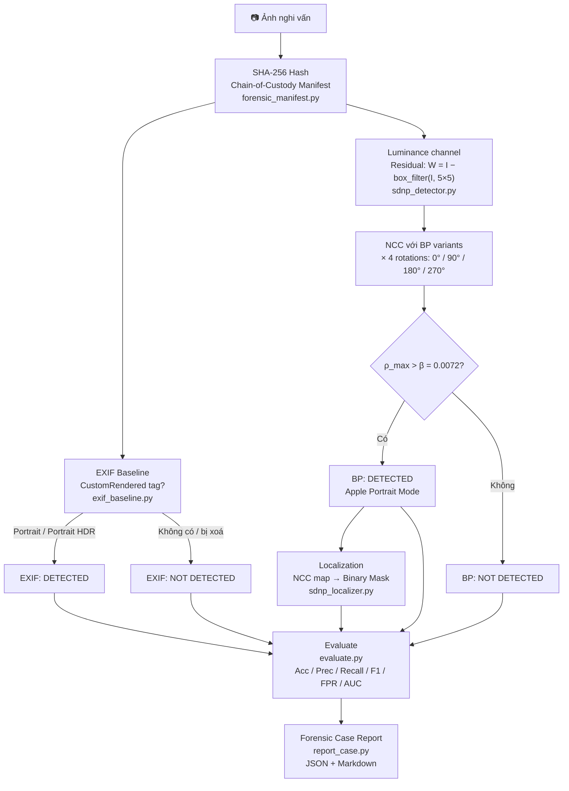

# Apple SDNP Forensic Toolkit
NT334.Q21.ANTT — Digital Forensics

---

## 📌 Giới thiệu (Overview)

Đây là đồ án môn học **Pháp chứng kỹ thuật số (Digital Forensics)**. Đề tài tập trung vào việc nghiên cứu và thực nghiệm dựa trên bài báo: *"Apple's Synthetic Defocus Noise Pattern: Characterization and Forensic Applications"*.

Dự án phân tích nhiễu giả lập **SDNP** trong chế độ chụp Chân dung (Portrait Mode) của iPhone và xây dựng forensic pipeline để:

- Phát hiện ảnh Apple Portrait Mode kể cả khi **EXIF bị xoá**
- Định vị vùng bokeh giả (localization)
- Đánh giá ảnh hưởng của SDNP đến kỹ thuật xác thực nguồn gốc camera (**PRNU**)

Pipeline mở rộng repo chính thức bằng: chain-of-custody manifest, EXIF baseline, robustness experiment, metrics đầy đủ, và forensic case report.

---

## ⚖️ Bài toán & Mô hình đe dọa

**Vấn đề:** Các thuật toán PRNU truyền thống bị nhầm lẫn giữa nhiễu vật lý (phần cứng) và nhiễu SDNP (phần mềm Apple chèn vào vùng bokeh). Điều này dẫn đến **Fingerprint Collision** — nhiều máy khác nhau bị nhận diện nhầm là cùng một máy.

**Mục tiêu của đồ án:**
- Xây dựng detector phát hiện ảnh Apple Portrait Mode bằng Base Pattern (BP)
- So sánh với EXIF baseline (CustomRendered tag) — thất bại khi EXIF bị xoá
- Đánh giá độ bền (robustness) khi ảnh bị strip EXIF / recompress / resize

---

## 🛠 Cài đặt

Yêu cầu Python ≥ 3.12. Xem `requirements.txt` để biết đầy đủ các thư viện.

```bash
python3 -m venv .venv
source .venv/bin/activate
pip install -r requirements.txt
```

---

## 🗂 Cấu trúc thư mục

```
./
├── src/
│   ├── BP_utils.py             ← Thư viện gốc từ repo chính thức (Apache 2.0)
│   ├── forensic_manifest.py    ← SHA-256 + chain-of-custody CSV
│   ├── exif_baseline.py        ← EXIF-only detector (baseline so sánh)
│   ├── sdnp_detector.py        ← BP detection: NCC + 4 rotations + threshold
│   ├── sdnp_localizer.py       ← NCC map + binary mask (localization)
│   ├── transform_images.py     ← Strip EXIF / JPEG recompress / resize
│   ├── evaluate.py             ← Metrics: Acc, Prec, Recall, F1, FPR, AUC
│   └── report_case.py          ← Forensic case report (JSON + Markdown)
├── scripts/
│   ├── run_original.sh         ← Pipeline chính + no-rotation baseline
│   ├── run_robustness.sh       ← Robustness experiment
│   └── reproduce_all.sh        ← Chạy toàn bộ
├── data/
│   ├── labels.csv              ← Ground truth (filename, label, source, notes)
│   ├── raw/                    ← Ảnh gốc (không commit)
│   ├── processed/              ← Ảnh sau transform (không commit)
│   └── bp/                     ← BP .mat files (không commit — tải từ repo gốc)
├── results/                    ← Output của pipeline (không commit)
└── deliverables/
    ├── report/                 ← LaTeX report
    └── slides/                 ← Presentation
```

---

## 🚀 Quy trình thực hiện (Pipeline)



**Chuẩn bị dữ liệu:** đặt ảnh vào `data/raw/`, điền `data/labels.csv`:

```csv
filename,label,source,notes
portrait_01.jpg,1,self-captured,iPhone 14 Portrait Mode
normal_01.jpg,0,self-captured,iPhone 14 standard
```

**Chạy:**

```bash
source .venv/bin/activate
bash scripts/reproduce_all.sh
```

---

## 📊 Kết quả thực nghiệm

*(Cập nhật sau khi chạy pipeline)*

| Điều kiện | Acc | Recall/TPR | FPR | F1 | AUC |
|-----------|-----|-----------|-----|----|-----|
| Original | — | — | — | — | — |
| EXIF stripped | — | — | — | — | — |
| JPEG Q80 | — | — | — | — | — |
| Resize 0.5 | — | — | — | — | — |
| No-rotation baseline | — | — | — | — | — |
| EXIF baseline | — | — | — | — | — |

---

# Checklist nhiệm vụ cần làm

## 1. Phần kỹ thuật

- [ ] Mô tả môi trường triển khai:
  - [ ] Hệ điều hành
  - [ ] CPU/RAM/GPU nếu có
  - [ ] Python version
  - [x] Thư viện trong `requirements.txt`
  - [ ] Công cụ hỗ trợ forensic / image processing

- [ ] Mô tả nguồn dữ liệu:
  - [ ] Ảnh Apple Portrait Mode
  - [ ] Ảnh không Portrait / ảnh đối chứng
  - [ ] Ảnh tự thu thập hoặc dataset công khai
  - [ ] File `labels.csv` chứa ground truth

- [ ] Tiền xử lý dữ liệu:
  - [ ] Chuẩn hóa tên file về lowercase
  - [ ] Lọc ảnh đúng resolution 4032×3024 hoặc 3024×4032
  - [ ] Gán nhãn ảnh trong `labels.csv`
  - [ ] Tạo manifest SHA-256
  - [ ] Tạo các biến thể robustness: strip EXIF, recompress JPEG, resize

- [ ] Vẽ sơ đồ pipeline:
  - [ ] Thu thập ảnh
  - [ ] Bảo toàn chứng cứ bằng hash
  - [ ] Kiểm tra EXIF baseline
  - [ ] Trích xuất residual
  - [ ] So khớp BP bằng NCC
  - [ ] Localization bằng NCC map / mask
  - [ ] Đánh giá metrics
  - [ ] Sinh forensic report

- [ ] Mô tả input – processing – output:
  - [ ] Input: folder ảnh, BP `.mat`, `labels.csv`
  - [ ] Processing: EXIF baseline, BP detection, localization, evaluation
  - [ ] Output: `sdnp_results.csv`, `metrics.json`, confusion matrix, ROC curve, case report

- [ ] Nếu tái hiện paper:
  - [ ] Nêu phần giữ nguyên từ paper
  - [ ] Nêu phần đơn giản hóa
  - [ ] Nêu phần nhóm tự bổ sung / cải tiến

## 2. Phần thực nghiệm và đánh giá

- [ ] Thiết kế thực nghiệm rõ ràng:
  - [ ] Original images
  - [ ] EXIF stripped
  - [ ] JPEG Q95 / Q80 / Q60
  - [ ] Resize 0.5 / 0.25
  - [ ] No-rotation baseline

- [ ] Có baseline hoặc đối chứng:
  - [ ] EXIF-only baseline
  - [ ] No-rotation baseline
  - [ ] Wrong-BP hoặc random-pattern control nếu kịp

- [ ] Sử dụng metrics phù hợp:
  - [ ] Accuracy
  - [ ] Precision
  - [ ] Recall / TPR
  - [ ] F1-score
  - [ ] False Positive Rate
  - [ ] ROC-AUC
  - [ ] Latency per image
  - [ ] Robustness theo từng điều kiện biến đổi ảnh

- [ ] Trình bày kết quả:
  - [ ] Bảng metrics tổng hợp
  - [ ] Confusion matrix
  - [ ] ROC curve
  - [ ] Ví dụ ảnh detected / not detected
  - [ ] Ví dụ NCC map và mask localization

## 3. Phân tích forensic

- [ ] Phân tích ưu điểm:
  - [ ] Không chỉ phụ thuộc EXIF
  - [ ] Có thể phát hiện artifact trong nội dung ảnh
  - [ ] Có output định lượng bằng NCC/rho
  - [ ] Có visualization bằng NCC map

- [ ] Phân tích hạn chế:
  - [ ] Phụ thuộc BP tham chiếu
  - [ ] Phụ thuộc resolution ảnh
  - [ ] Ảnh resize/crop mạnh có thể làm giảm hiệu quả
  - [ ] Không định danh tuyệt đối thiết bị nguồn

- [ ] Phân tích rủi ro sai lệch:
  - [ ] False positive
  - [ ] False negative
  - [ ] Ảnh bị chỉnh sửa / recompress / mạng xã hội làm suy giảm dấu vết
  - [ ] Metadata có thể bị xóa hoặc giả mạo

- [ ] Phạm vi áp dụng:
  - [ ] Phù hợp cho image forensics
  - [ ] Phù hợp để hỗ trợ điều tra ảnh nghi vấn Apple Portrait Mode
  - [ ] Không dùng như bằng chứng duy nhất để kết luận thiết bị nguồn

## 4. Giá trị thực tiễn và khả năng mở rộng

- [ ] Thảo luận giá trị với quy trình điều tra số:
  - [ ] Hỗ trợ triage ảnh nghi vấn
  - [ ] Hỗ trợ khi EXIF bị xóa
  - [ ] Tạo báo cáo có hash, kết quả detection và kết luận forensic

- [ ] Khả năng dùng trong lab học thuật:
  - [ ] Có script reproduce
  - [ ] Có dataset nhỏ tự thu thập
  - [ ] Có metrics để so sánh
  - [ ] Có output dễ kiểm chứng

- [ ] Khả năng mở rộng:
  - [ ] Thêm nhiều BP hơn
  - [ ] Hỗ trợ nhiều resolution hơn
  - [ ] Scale-aware detection
  - [ ] Tự động sinh report đầy đủ
  - [ ] Kết hợp PRNU masking nếu có đủ dữ liệu

## 5. Checklist hoàn thiện GitHub

- [ ] `README.md` mô tả đầy đủ project
- [ ] `requirements.txt` chạy được
- [ ] Có hướng dẫn cài đặt
- [ ] Có hướng dẫn chạy demo
- [ ] Có cấu trúc thư mục rõ ràng
- [ ] Có script chạy toàn bộ pipeline
- [ ] Có kết quả mẫu trong `results/`
- [ ] Có report hoặc notebook phân tích kết quả
- [ ] Có hình pipeline / workflow
- [ ] Có phần limitations và forensic interpretation

---
## 📜 Tài liệu tham khảo

> David Vázquez-Padín, Fernando Pérez-González, Pablo Pérez-Miguélez.
> *"Apple's Synthetic Defocus Noise Pattern: Characterization and Forensic Applications."*
> IEEE Transactions on Information Forensics and Security, 2026.
> [IEEE](https://ieeexplore.ieee.org/document/11346806) | [arXiv 2505.07380](https://arxiv.org/abs/2505.07380)
>
> Repo chính thức: [github.com/dvazquezpadin/apple-sdnp](https://github.com/dvazquezpadin/apple-sdnp)
