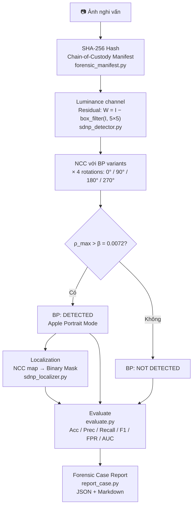

# Apple SDNP Forensic Toolkit
NT334.Q21.ANTT — Digital Forensics

---

## 📌 Giới thiệu (Overview)

Đây là đồ án môn học **Pháp chứng kỹ thuật số (Digital Forensics)**. Đề tài tập trung vào việc nghiên cứu và thực nghiệm dựa trên bài báo: *"Apple's Synthetic Defocus Noise Pattern: Characterization and Forensic Applications"*.

Dự án phân tích nhiễu giả lập **SDNP** trong chế độ chụp Chân dung (Portrait Mode) của iPhone và xây dựng forensic pipeline để:

- Phát hiện ảnh Apple Portrait Mode kể cả khi **EXIF bị xoá**
- Định vị vùng bokeh giả (localization)
- Đánh giá ảnh hưởng của SDNP đến kỹ thuật xác thực nguồn gốc camera (**PRNU**)

Pipeline mở rộng repo chính thức bằng: chain-of-custody manifest, robustness experiment, metrics đầy đủ, và forensic case report.

---

## ⚖️ Bài toán & Mô hình đe dọa

**Vấn đề:** Các thuật toán PRNU truyền thống bị nhầm lẫn giữa nhiễu vật lý (phần cứng) và nhiễu SDNP (phần mềm Apple chèn vào vùng bokeh). Điều này dẫn đến **Fingerprint Collision** — nhiều máy khác nhau bị nhận diện nhầm là cùng một máy.

**Mục tiêu của đồ án:**
- Xây dựng detector phát hiện ảnh Apple Portrait Mode bằng Base Pattern (BP)
- Đánh giá độ bền (robustness) khi ảnh bị strip EXIF / recompress / resize

---

## 🛠 Cài đặt

Yêu cầu Python ≥ 3.12. Xem `requirements.txt` để biết đầy đủ các thư viện.

```bash
python3 -m venv .venv
source .venv/bin/activate
pip install -r requirements.txt
```

---

## 🗂 Cấu trúc thư mục

```
./
├── src/
│   ├── BP_utils.py             ← Thư viện gốc từ repo chính thức (Apache 2.0)
│   ├── forensic_manifest.py    ← SHA-256 + chain-of-custody CSV
│   ├── sdnp_detector.py        ← BP detection: NCC + 4 rotations + threshold
│   ├── sdnp_localizer.py       ← NCC map + binary mask (localization)
│   ├── transform_images.py     ← Strip EXIF / JPEG recompress / resize
│   ├── evaluate.py             ← Metrics: Acc, Prec, Recall, F1, FPR, AUC
│   └── report_case.py          ← Forensic case report (JSON + Markdown)
├── scripts/
│   ├── run_original.sh         ← Pipeline chính + no-rotation baseline
│   ├── run_robustness.sh       ← Robustness experiment
│   ├── run_filter_comparison.sh← So sánh residual filter
│   ├── run_fpr_controls.sh     ← Đo FPR trên negative controls
│   └── reproduce_all.sh        ← Chạy toàn bộ
├── data/
│   ├── labels.csv              ← Ground truth cho official dataset
│   ├── labels_official.csv     ← Bản labels riêng cho official dataset
│   ├── labels_fpr_controls.csv ← Ground truth negative controls
│   ├── labels_legacy.csv       ← Ground truth cũ trước khi chuyển dataset
│   ├── raw/
│   │   └── apple_sdnp_official/ ← Official Apple Portrait Image Dataset
│   ├── processed/              ← Ảnh sau transform (không commit)
│   └── bp/                     ← BP .mat files (không commit — tải từ repo gốc)
├── results/                    ← Output benchmark mẫu dùng để báo cáo metrics
├── results_residual/           ← Kết quả so sánh filter residual
└── deliverables/
    ├── report/                 ← LaTeX report
    └── slides/                 ← Presentation
```

---

## 🚀 Quy trình thực hiện (Pipeline)



**Dataset hiện tại:** project đã được chuẩn bị với official **Apple Portrait Image Dataset** từ README của repo tác giả (`dvazquezpadin/apple-sdnp`):

- 560 ảnh direct-release trong ZIP chính thức.
- 717 ảnh Flickr được tải từ `original_download_url` trong các JSON chính thức, chỉ gồm license được tác giả ghi nhận.
- Tổng cộng: 1277 ảnh, tất cả label `1` vì đây là Apple Portrait Image Dataset.
- Root chạy pipeline: `data/raw/apple_sdnp_official/`.
- Labels dùng mặc định: `data/labels.csv`; bản riêng cùng nội dung: `data/labels_official.csv`.
- Manifest SHA-256: `data/raw/apple_sdnp_official/official_manifest.csv`.

**FPR negative controls:** để đo False Positive Rate, project dùng hướng tách riêng tập đối chứng từ **PrnuModernDevices**:

- Nguồn official: `https://lesc.dinfo.unifi.it/PrnuModernDevices/`.
- README của `apple-sdnp` dùng ảnh `C21/bokeh/...` từ PrnuModernDevices trong ví dụ localization, nên đây là nguồn đã được paper/repo nhắc tới.
- Chỉ dùng `C01-C18` làm negative non-Apple controls.
- Không dùng `C19-C22` cho FPR negative vì paper PrnuModernDevices liệt kê chúng là Apple iPhone.
- Expected set: 450 ảnh (`18` devices × `25` ảnh), gồm `bokeh`, `flat`, `nat`.
- Labels riêng: `data/labels_fpr_controls.csv`.
- Manifest riêng: `data/raw/fpr_controls/PrnuModernDevices_C01_C18_manifest.csv`.
- Completeness status: `data/raw/fpr_controls/PrnuModernDevices_C01_C18_summary.json`.

Chuẩn bị/resume download FPR controls:

```bash
python3 scripts/prepare_fpr_controls.py --make-curl-config --make-url-list
curl --parallel --parallel-max 2 --fail --location --continue-at - --create-dirs --retry 10 --retry-delay 10 --config data/raw/fpr_controls/prnu_modern_c01_c18.curl
python3 scripts/prepare_fpr_controls.py --write-labels --write-manifest --write-summary
```

Chạy FPR controls:

```bash
bash scripts/run_fpr_controls.sh
```

**Chạy:**

```bash
source .venv/bin/activate
bash scripts/reproduce_all.sh
```

`reproduce_all.sh` tái hiện benchmark positive/robustness/filter. FPR controls là bước riêng vì cần tải negative dataset trước:

```bash
bash scripts/run_fpr_controls.sh
```

---

## 📊 Kết quả thực nghiệm

Ngưỡng paper: `β = 0.0072`. Với các tập chỉ có một lớp, ROC-AUC không xác định được nên ghi `N/A`.

| Điều kiện | N hợp lệ | Acc | Precision | Recall/TPR | FPR | F1 | AUC | Latency TB |
|-----------|---------:|----:|----------:|-----------:|----:|---:|----:|-----------:|
| Original | 1144 | 0.9781 | 1.0000 | 0.9781 | 0.0000 | 0.9890 | N/A | 3238.3 ms |
| EXIF stripped | 1260 | 0.9802 | 1.0000 | 0.9802 | 0.0000 | 0.9900 | N/A | 3293.7 ms |
| JPEG Q95 | 1260 | 0.9802 | 1.0000 | 0.9802 | 0.0000 | 0.9900 | N/A | 3097.3 ms |
| JPEG Q80 | 1260 | 0.9587 | 1.0000 | 0.9587 | 0.0000 | 0.9789 | N/A | 3195.7 ms |
| JPEG Q60 | 1260 | 0.8865 | 1.0000 | 0.8865 | 0.0000 | 0.9398 | N/A | 3064.1 ms |
| Resize 0.5 | 1260 | 0.9690 | 1.0000 | 0.9690 | 0.0000 | 0.9843 | N/A | 1883.6 ms |
| Resize 0.25 | 1260 | 0.7905 | 1.0000 | 0.7905 | 0.0000 | 0.8830 | N/A | 964.4 ms |
| No-rotation baseline | 1144 | 0.7360 | 1.0000 | 0.7360 | 0.0000 | 0.8479 | N/A | 975.9 ms |
| FPR negative controls | 85 | 1.0000 | N/A | N/A | 0.0000 | N/A | N/A | 801.9 ms |

Lưu ý:

- `Precision` và `FPR` trong các tập positive-only không phản ánh khả năng tránh false positive, vì các tập này không có ảnh negative.
- FPR được đo riêng trên `PrnuModernDevices C01-C18`; chỉ 85/450 ảnh khớp resolution strict với BP 12MP nên được tính hard-decision.
- `Original` hiện dùng `.jpg` và `.heic`; một phần `.jpeg` chính thức chưa được đưa vào benchmark đã chốt để giữ nguyên kết quả cũ.
- Resize dùng chế độ scale-aware để khảo sát suy giảm tín hiệu, không hoàn toàn tương đương điều kiện paper gốc.

---

# Trạng thái nghiệm thu

| Hạng mục | Trạng thái | Artifact |
|---|---|---|
| Reproduce một phần paper | Hoàn thành | `src/sdnp_detector.py`, `scripts/reproduce_all.sh` |
| Chain-of-custody manifest | Hoàn thành | `src/forensic_manifest.py`, `results/original/manifest.csv` |
| Official Apple Portrait dataset | Hoàn thành | `data/labels.csv`, `data/labels_official.csv` |
| Negative controls cho FPR | Hoàn thành | `data/labels_fpr_controls.csv`, `results/fpr_controls/` |
| Robustness benchmark | Hoàn thành | `results/exif_stripped/`, `results/jpeg_q*/`, `results/resize_*/` |
| Baseline/control | Hoàn thành | `results/no_rotation_control/`, `results/fpr_controls/` |
| Filter comparison | Hoàn thành | `results_residual/comparison_summary.csv` |
| Forensic case report | Hoàn thành | `results/original/case_report.md`, `results/original/case_report.json` |
| Localization module | Có sẵn | `src/sdnp_localizer.py`, web demo |
| Metrics analysis report | Hoàn thành | `deliverables/report/benchmark_results_report.md` |

## Hạn chế đã ghi nhận

- Detector strict hiện ưu tiên BP 12MP, nên ảnh khác resolution bị skip nếu không chạy `--scale-aware`.
- Benchmark đã chốt không thêm lại `.jpeg` để tránh làm thay đổi kết quả cũ.
- FPR strict chỉ tính trên negative controls có resolution tương thích với BP hiện tại.
- Kết quả này hỗ trợ điều tra ảnh nghi vấn Apple Portrait Mode, không phải bằng chứng duy nhất để định danh thiết bị nguồn.

---
## 📜 Tài liệu tham khảo

> David Vázquez-Padín, Fernando Pérez-González, Pablo Pérez-Miguélez.
> *"Apple's Synthetic Defocus Noise Pattern: Characterization and Forensic Applications."*
> IEEE Transactions on Information Forensics and Security, 2026.
> [IEEE](https://ieeexplore.ieee.org/document/11346806) | [arXiv 2505.07380](https://arxiv.org/abs/2505.07380)
>
> Repo chính thức: [github.com/dvazquezpadin/apple-sdnp](https://github.com/dvazquezpadin/apple-sdnp)
